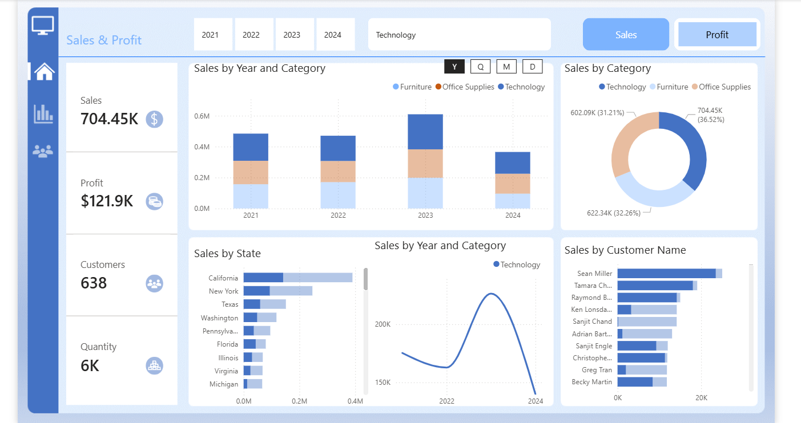

# Sales & Profit Analysis | Revenue Trends and Business Insights
Excel + Power Bi Project | Retail Sales Data | From Raw Data into Actionable Business Insights

### Table of Contents
* [Project Overview](#project-overview)
* [Business Problem](#business-problem)
* [Tools & Technologies](#tools--technologies)
* [Data Description](#data-description)
* [Data Cleaning Process](#data-cleaning-process)
* [Power BI Dashboard](#power-bi-dashboard)
* [Key Insights](#key-insights)
* [Business Recommendation](#business-recommendations)
* [Dashboard Preview](#dashboard-preview)
* [Project Outcome](#project-outcome)
* [Dataset Access](#dataset-access)

## Project Overview
This project analyzes retail sales data to uncover key trends in revenue, product performance, regional sales distribution, customer contributions and overall profitability. Excel was used for data exploration and transformation, while Power BI was utilized for data visualizations and dashboard creation. The project transforms raw transaction data into meaningful insights that support business performance evaluation and strategic decision-making.

## Business Problem
The company needed to understand:

- Which products generate the most revenue
- Which regions are underperforming
- Seasonal sales patterns
- Profitability trends across categories

## Tools & Technologies

- **Microsoft Excel** – Data cleaning, exploration, and transformation  
- **Power BI** – DAX, Data modeling, visualization, and interactive dashboard creation
  
## Data Description
The dataset used in this project contains retail sales transaction records that capture business operations across different regions, product categories, and customer segments.
Key data fields include:

- Order Date – Transaction date of each sale
- Customer Name – Customers contributing to revenue 
- Customer Region – Geographic location of sales  
- Product Category – Type of products sold  
- Sales Amount – Revenue generated from each transaction  
- Profit – Profit earned from each sale  
- Quantity – Number of items sold
  
This dataset provides a comprehensive view of business performance and supports detailed analysis of sales trends, profitability, and customer behavior.

## Data Cleaning Process
The analysis followed a structured workflow to ensure accurate insights and effective reporting:

- Cleaned the dataset by handling missing and invalid values  
- Converted date fields into proper datetime format  
- Created new calculated fields such as Revenue (Quantity × Unit Price)  
- Performed data modeling and established relationships in Power BI  
- Developed DAX measures for key metrics including Total Sales, Profit, Customers, and Quantity  
- Built interactive dashboards to visualize business performance and trends
## Power BI Dashboard

The interactive Power BI dashboard provides a comprehensive view of business performance through the following key visualizations:

- 📊Revenue and profit trends over time  
- 🗺️Regional sales performance across different states  
- ⭐Top-performing product categories  
- 📈Monthly and quarterly sales growth patterns  
- 🧑Customer contribution analysis

## Key Insights

1. Sales trends showed a steady increase from 2021 to 2023, followed by a noticeable decline in 2024.  

2. Technology products were among the top-performing categories, contributing significantly to overall sales.  

3. Sales were highly concentrated in specific regions, with California and New York leading in revenue generation.  

4. Customer contribution analysis revealed that a small group of customers accounted for a large share of total sales.  

5. Overall business performance varied across categories and regions, indicating opportunities for strategic improvement.
  
## Business Recommendations

Based on the analysis, the following strategic actions are recommended:

- Focus marketing and operational efforts on high-performing regions such as California and New York to maximize revenue growth.  

- Strengthen sales strategies for top-performing product categories while reviewing pricing and cost structures for lower-performing segments.  

- Implement customer retention programs to maintain relationships with high-value customers who contribute significantly to total revenue.  

- Investigate causes of the sales decline observed in 2024 and develop targeted strategies to restore growth.  

- Continuously monitor sales and profit trends using interactive dashboards to support data-driven decision-making.

  ## Dashboard Preview

 ## Project Outcome
 This analysis successfully transformed raw retail transaction data into a comprehensive business performance dashboard. The project provides clear insights into sales trends, regional performance, product category contributions, and customer behavior. 

By leveraging Excel for data preparation and Power BI for visualization and modeling, the dashboard enables stakeholders to monitor key performance metrics, identify growth opportunities, and support data-driven decision-making.

## Dataset Access
 The dataset used for this analysis is included in this repository.
 
## Author
**Zuera Alabi**  
Data Analyst | Python | Excel | Power BI | SQL  

Passionate about transforming raw data into meaningful insights that support business decision-making.

