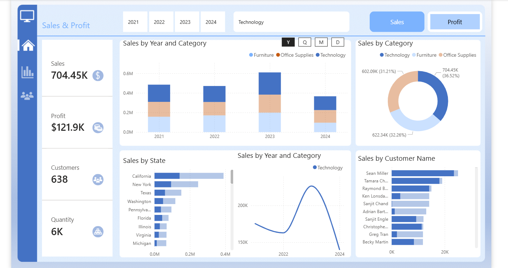
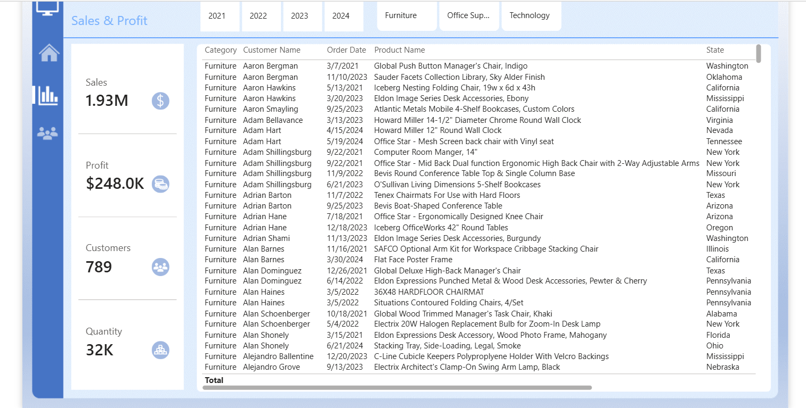

# 🛒 Sales & Profit Analysis
## Revenue Trends and Business Performance Insights

## 📌 Project Overview
This project analyses retail sales transaction data to identify 
revenue trends, product performance, regional distribution and 
overall profitability. Using Microsoft Excel for data cleaning 
and Power BI for interactive visualisation, the analysis 
transforms raw transactional data into actionable business 
intelligence that supports decision-making, performance 
evaluation and strategic planning.

## 🎯 Business Problem
The business lacks clear visibility into its sales performance 
across products, regions and customer segments. Without this 
understanding, strategic decisions around pricing, marketing 
and regional expansion remain reactive rather than data-driven.

The analysis focused on answering the following business questions:
- Which products generate the most revenue?
- Which regions are underperforming?
- What are the seasonal sales patterns?
- How does profitability vary across product categories?

## 🛠️ Tools & Technologies
| Tool | Purpose |
|------|---------|
| Microsoft Excel | Data cleaning and exploratory analysis |
| Power BI | Data modelling, DAX calculations and dashboard development |
| GitHub | Version control and documentation |

## 📊 Dashboard Preview

## Sales Data Table

## 🔍 Key Findings

❖ Sales grew steadily from 2021–2023 but declined in 2024 
  suggesting possible market or operational challenges

❖ Technology products were the top revenue drivers across 
  all product categories

❖ Revenue was highly concentrated in a few regions indicating 
  dependency risk and untapped growth potential elsewhere

❖ A small group of customers generated a large share of total 
  sales highlighting the importance of customer retention

❖ Performance varied across regions and categories highlighting 
  opportunities for targeted improvements

## 💡 Business Recommendations

❖ Strengthen sales strategies for top-performing product 
  categories while reviewing pricing and cost structures 
  for lower-performing segments

❖ Implement customer retention programmes to maintain 
  relationships with high-value customers who contribute 
  significantly to total revenue

❖ Investigate causes of the sales decline observed in 2024 
  and develop targeted strategies to restore growth

❖ Continuously monitor sales and profit trends using 
  interactive dashboards to support data-driven decision-making

## 👩🏽‍💻 About the Author
**Zuera Alabi**
Data Analyst | Python | SQL | Power BI | Excel

Behind every dataset is a decision waiting to be made, 
I help businesses find it.

🔗 [LinkedIn](https://www.linkedin.com/in/zuera-alabi-4b85a7282/)
🔗 [GitHub](https://github.com/zuera-alabi)
